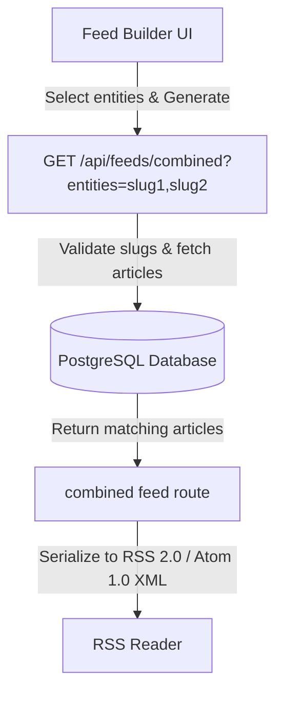

# Feed Builder Architecture

This document specifies the design, endpoints, and user interface for the custom RSS/Atom combined feed generation system.

## 1. Core Workflow

## 2. API Endpoints

### Combined RSS Feed
- **Route**: `GET /api/feeds/combined?entities=slug1,slug2`
- **Controller**:
  1. Splices query parameters to extract list of slugs.
  2. Resolves slugs to `entities.id` values.
  3. Queries `entity_mentions` and matches `article_links` where `is_suppressed = FALSE`.
  4. Orders by `published_at DESC`, limiting to 50.
  5. Serializes rows to RSS 2.0 XML with custom XML header and metadata.
  6. Directs outbound links to `/sendit/:hash` per the **LINK DOCTRINE** with tracking source tags (`?src=rss_builder`).

### Single Entity RSS Feed
- **Route**: `GET /api/entities/:slug/feed.rss`
- **Controller**: Returns RSS 2.0 feed matching only the single specified entity.

## 3. UI Component (`/builder`)
The Feed Builder UI is implemented as a client hydrated React interface in Next.js.
- **Components**:
  - `EntitySelector`: As the user types, queries `/api/entities?q=` to fetch matches.
  - `ChipsDisplay`: Renders selected entities as pill elements tinted with their `dominant_color` and showing the matching `getSymbolForEntityType(type)` symbol.
  - `FeedPreview`: Visualizes the last 10 articles matching the selected combination, highlighting the publisher and published date.
  - `ClipboardWidget`: Generates the RSS feed link and exports it to the system clipboard on click.

## 4. Multi-Niche Portability
The system is built entirely around dynamic relational entities and types (`entity_types`, `entities`), avoiding any hard-coded nices (such as "sailing" or "boats"). To adopt the system for other domains (e.g. climbing, aviation), operators simply update the seeded `entity_types` and `entities` tables.
