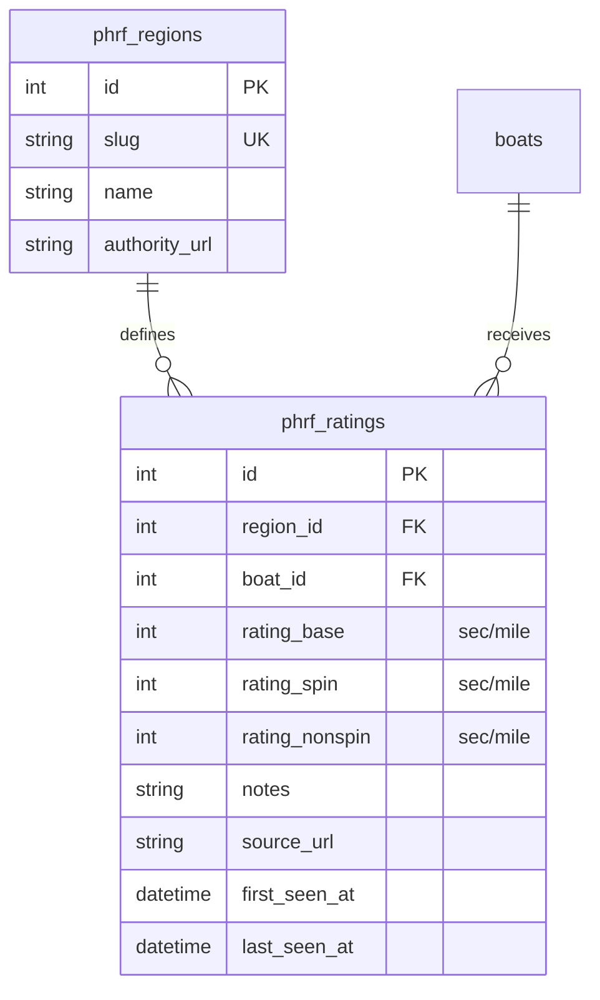
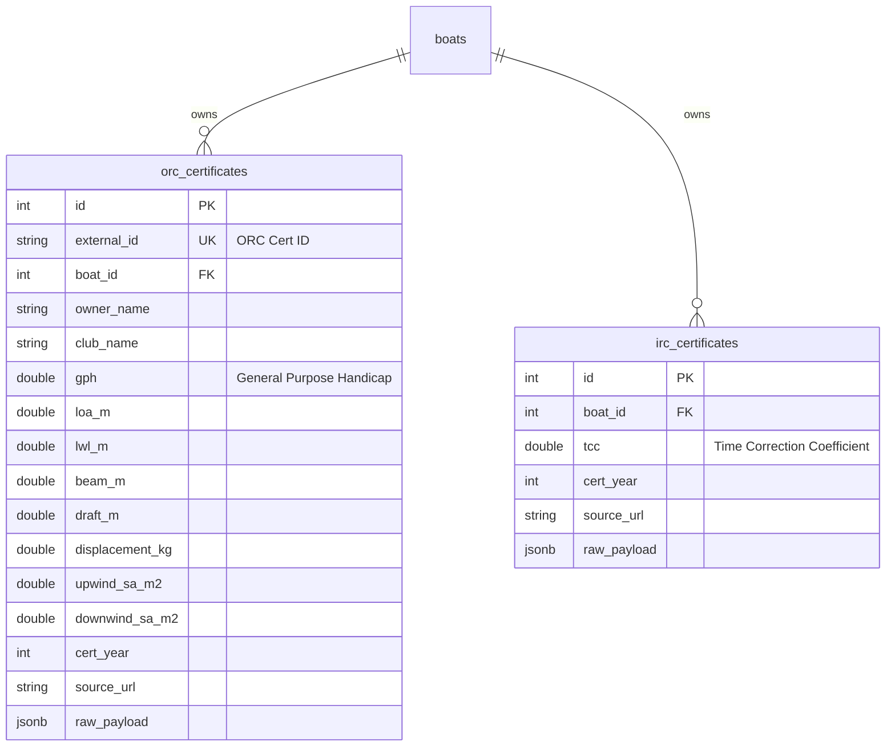

# Handicap System & PHRF Explorer Architecture

The **Handicap System** provides structural calculations and comparison tools for sailboat racing handicaps. The initial release focuses on the **Performance Handicap Racing Fleet (PHRF)** system, incorporating regional adjustments and crowd-sourced lead generation tools.

---

## 1. Database Schema

The handicap database stores regional definitions and fleet ratings for boat profiles.



* **Idempotency**: The `phrf_ratings` table includes a `UNIQUE (region_id, boat_id)` constraint, enabling clean upserts (`ON CONFLICT`) during batch CSV ingestion.

---

## 2. Handicap Formulas (`@stax/handicap-core`)

The [@stax/handicap-core](file:///packages/handicap-core/src/index.ts) package implements clean mathematical helpers for race scoring and time allowance comparisons:

### Time-on-Distance (ToD)
Corrected time is calculated by deducting a handicap allowance per mile from the elapsed duration:
$$\text{Corrected Time} = \text{Elapsed Time (s)} - (\text{PHRF Rating} \times \text{Distance (NM)})$$
* **Function**: `scorePHRFToD(elapsedSeconds, distanceNm, ratingSecPerMile)`

### Time-on-Time (ToT)
Corrected time is scaled by a Time Correction Factor (TCF) derived from the PHRF rating:
$$\text{TCF} = \frac{A}{B + \text{PHRF Rating}}$$
$$\text{Corrected Time} = \text{Elapsed Time (s)} \times \text{TCF}$$
* **Default Coefficients**: $A = 650$ (middle wind range), $B = 550$ (standard divisor).
* **Function**: `scorePHRFToT(elapsedSeconds, ratingSecPerMile, A, B)`

### Time Allowance Deltas
* **ToD Offset**: Calculates the seconds difference between two ratings over a given distance:
  $$\Delta = (\text{Rating A} - \text{Rating B}) \times \text{Distance (NM)}$$
* **ToT Offset**: Computes corrected time differences for a shared elapsed duration.

---

## 3. CSV Data Ingestion

The [ingest-phrf-region.ts](file:///scripts/ingest-phrf-region.ts) script loads CSV tables containing fleet ratings:
* **Headers**: `boat_class`, `rating_base`, `rating_spin`, `rating_nonspin`, `notes`
* **Fuzzy Matching**: Matches CSV boat names against the canonical `boats` registry using builder/model substrings, stripping non-alphanumeric characters.
* **Command**:
  ```bash
  npx tsx scripts/ingest-phrf-region.ts <region-slug> <csv-path> [region-name]
  ```

---

## 4. API Endpoints

### `GET /api/handicap/phrf/regions`
Lists all active PHRF regions, ordered alphabetically by name.

### `GET /api/handicap/phrf/ratings`
Returns ratings for a specific boat ID, optionally filtered by a comma-separated list of region slugs:
* **Query Parameters**: `boat_id` (integer, required), `regions` (string, optional).

### `POST /api/handicap/phrf/compare`
Calculates course allowances and pairwise deltas for a boat across regions:
* **Request Body**:
  ```json
  {
    "boat_id": 1,
    "regions": ["galveston-bay", "chesapeake-bay", "socal"],
    "distance_nm": 10.0
  }
  ```
* **Response Payload**: Includes boat details, distance, region comparisons (with raw ratings and allowances), and pairwise deltas showing seconds owed between regions.

---

## 5. Next.js PHRF Explorer UI

The public tool at `/handicap/phrf` implements:
1. **Interactive Configurator**: A multi-step flow where users search boat models (via live autocomplete), choose up to 3 regions, and specify a course distance.
2. **Ratings Table**: Displays spinnaker, non-spinnaker, and base ratings alongside calculated time allowances.
3. **Corrected Time Chart**: A pure-CSS bar chart showing corrected times across regions for an adjustable elapsed time slider.
4. **Content Hooks**: Inline educational callouts explaining regional rating discrepancies and rating appeals.
5. **CTA Sign-up**: Subscribes users to the "Handicap HQ" newsletter frequency.

---

## 6. ORC & IRC Certificates Database

The offshore rating schema stores official certificate properties to enable tactical heuristics:



* **Ingestion Scripts**:
  - `npx tsx scripts/ingest-orc-certificates.ts <json-file-path>`: Fuzzy maps certificate data to the boats registry and upserts entries.
  - `npx tsx scripts/ingest-irc-certificates.ts <json-file-path>`: Standardizes and inserts IRC multipliers.

---

## 7. Cross-System Estimation Logic

Provides educational equivalent projections derived from base PHRF numbers:

### ORC GPH Estimation
$$\text{GPH}_{\text{base}} = \text{PHRF} + 525$$
* **Refinement**: Adjusted for Displacement-to-Length ($D/L$) ratio. Low $D/L$ (planing hull) reduces projected GPH by 6 seconds/mile (rates faster); high $D/L$ (heavy keel) adds 6 seconds/mile.
* **Function**: `estimateORCFromPHRF(phrfRating, boatSpecs)`

### IRC TCC Estimation
$$\text{TCC}_{\text{base}} = \frac{650}{550 + \text{PHRF}}$$
* **Refinement**: Adjusted for Sail Area-to-Displacement ($SA/D$) ratio. Highly-powered hulls ($SA/D > 22$) increase projected TCC by $+0.012$ (rate faster); under-powered hulls ($SA/D < 15$) decrease TCC by $-0.012$.
* **Function**: `estimateTCCFromPHRF(phrfRating, boatSpecs)`

---

## 8. Tactical Fleet Intel & Ratios

Tactical advisor matches fleet listings against certificate specifications:

* **SA/D Ratio**:
  $$\text{SA/D} = \frac{\text{Sail Area (m}^2\text{)}}{\left(\frac{\text{Displacement (kg)}}{1025}\right)^{2/3}}$$
* **D/L Ratio**:
  $$\text{D/L} = \frac{\frac{\text{Displacement (kg)}}{1016.05}}{(0.01 \times \text{LWL (m)})^3}$$
* **Heuristics**:
  - **Light Wind Favored**: $SA/D > 22$ and $D/L < 160$ (highly powered, light hull).
  - **Heavy Wind Favored**: $D/L > 240$ (stable, heavy displacement).
  - **Moderate All-Rounder**: Standard ratios.
* **Sorter**:
  - `light`: Sorts fleet descending by $SA/D$ (highest power first).
  - `heavy`: Sorts fleet descending by $D/L$ (highest stability first).
  - `medium`: Sorts fleet ascending by $GPH$ (fastest absolute speed first).

