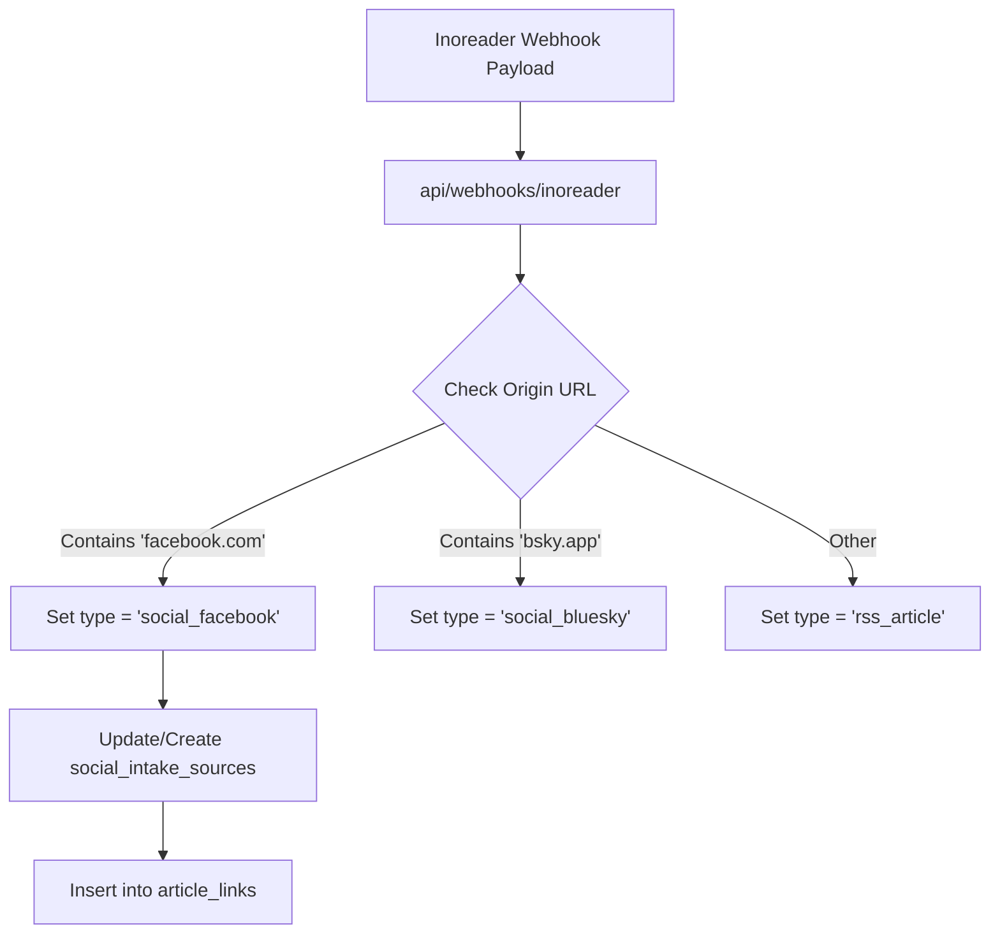

# Inoreader Facebook Ingestion & Registry Plan

This document outlines the architecture and execution plan for bulk public Facebook page ingestion via Inoreader Pro, integrating with the `social_intake_sources` registry.

## 1. Core Objectives
- **Automate Ingestion:** Convert public Facebook page links into structured signals within `article_links`.
- **Intake Registry:** Track ingestion status, rate limits, and failure history in `social_intake_sources`.
- **System Boundaries:** Maintain a clean separation between third-party retrieval methods (Inoreader vs. Apify) and database storage.

---

## 2. Ingestion Registry Table

The database schema (`infra/db/migrations/026_social_intake_registry.sql`) defines the following tracking structure:

```sql
CREATE TABLE IF NOT EXISTS social_intake_sources (
  id SERIAL PRIMARY KEY,
  platform TEXT NOT NULL,                  -- 'facebook', 'instagram', 'twitter', etc.
  source_url TEXT NOT NULL UNIQUE,         -- URL of the page/source
  ingestion_method TEXT NOT NULL,          -- 'inoreader_facebook', 'apify_instagram', etc.
  status TEXT NOT NULL DEFAULT 'active',   -- 'active', 'paused', 'error'
  last_success TIMESTAMPTZ,
  last_error TEXT,
  created_at TIMESTAMPTZ DEFAULT NOW(),
  updated_at TIMESTAMPTZ DEFAULT NOW()
);
```

### Ingestion Methods
1. **`inoreader_facebook`**: Leverages Inoreader Pro to subscribe directly to public Facebook pages.
2. **`apify_instagram`**: Uses Apify tasks to poll Instagram profiles.
3. **`feed_rss`**: Standard RSS polling (fallback/reference).

---

## 3. Bulk Subscription & Setup Flow

Inoreader Pro allows subscribing directly to public Facebook pages.

### Step 1: Bulk Input Collection
Public page URLs are gathered from race registries and regional sailing directories:
- `https://www.facebook.com/USASailing`
- `https://www.facebook.com/WorldSailing`
- `https://www.facebook.com/[YACHT_CLUB_PAGE]`

### Step 2: Feed Creation & Classification
1. Subscriptions are created by pasting the URLs into Inoreader's search bar.
2. New feeds are organized under the **Almanac** folder.
3. Upon first webhook dispatch to `https://api.sailsouthern.com/api/webhooks/inoreader`, the system registers the source:
   - Queries `social_intake_sources` for `source_url`.
   - If not found, automatically creates the registry record with `platform = 'facebook'` and `ingestion_method = 'inoreader_facebook'`.

---

## 4. API Mappings & Webhook Ingest

When the webhook fires from Inoreader, the payload maps as follows:



### Mapping Fields

| Inoreader Webhook Field | Target Table: `article_links` | Target Table: `social_intake_sources` |
|---|---|---|
| `canonical[0].href` | `canonical_url` | `source_url` (origin base path) |
| `origin.title` | `publisher_name` | - |
| `title` | `title` | - |
| `published` | `published_at` (convert epoch) | `last_success` |
| `summary.content` | `content_snippet` | - |
| - | `metadata.source_type = 'social_facebook'` | `platform = 'facebook'` |

---

## 5. Rate Limits & Quotas

Integrating third-party social integrations introduces platform boundaries:

> [!WARNING]
> **Inoreader Social Subscription Quotas:**
> - Inoreader Pro tiers restrict the number of social connections (e.g. 20 or 60 concurrent social pages).
> - Exceeding these limits will result in subscription failures in Inoreader's UI.

### Strategic Mitigation
- **Niche Prioritization:** Standardize on active yacht clubs/fleets. Remove dormant social feeds (no updates within 90 days).
- **Scale Out Option:** If the registry surpasses 100 Facebook/Instagram feeds:
  - Transition high-volume sources to **Apify Scrapers** (`apify_instagram` / `apify_facebook`).
  - Update `ingestion_method` in `social_intake_sources` to track their individual runs and last success state.
