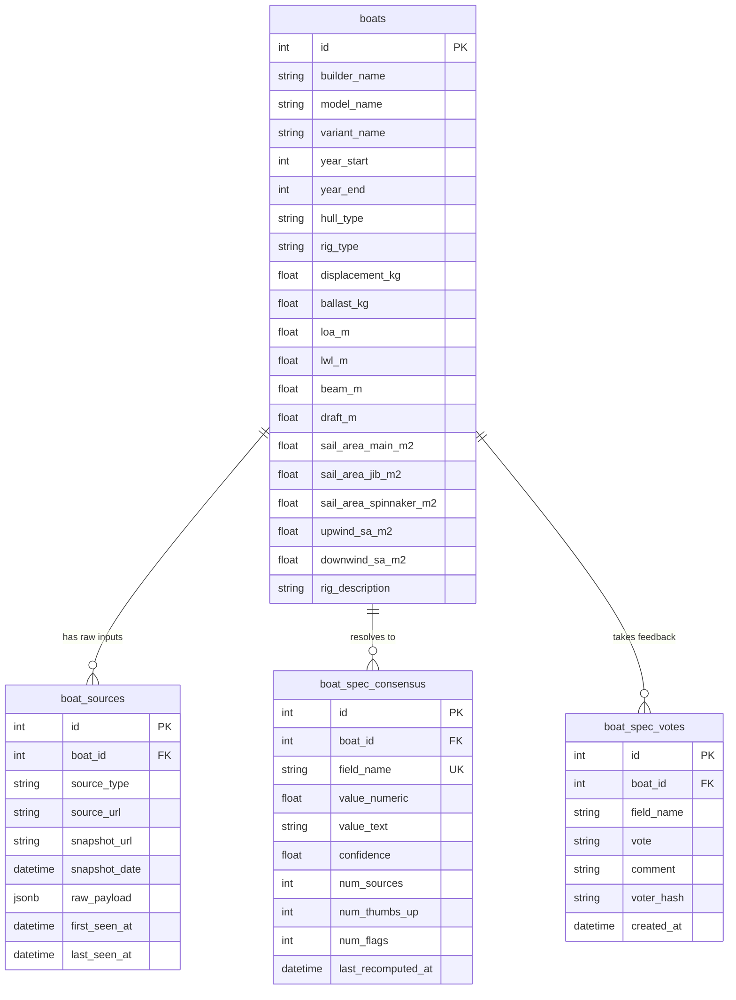

# Rig Spec Graph & Ingestion Architecture

The **Rig Spec Graph** provides the canonical database registry for sailboat hulls, specifications, and rig dimensions. By utilizing a multi-layered design—separating raw crawler payloads, provenance tracking, and statistically merged consensus values—it ensures data accuracy while maintaining a transparent audit trail of external sources.

---

## 1. Database Schema Design

The rig specifications system splits data into four key layers:



### Table Roles
1. **`boats`**: The canonical registry of boat models and their merged, resolved specifications. This table is optimized for quick select queries from applications and handicap calculators.
2. **`boat_sources`**: Immutable raw crawls of external websites or manual inputs. Multiple sources can map to the same `boat_id`, establishing provenance.
3. **`boat_spec_consensus`**: Recomputed field-level specification values, along with confidence ratings (from `0.0` to `1.0`), showing statistical agreement and user vote modifiers.
4. **`boat_spec_votes`**: A crowd-sourced feedback loop allowing users to vote up or flag individual consensus measurements to adjust confidence thresholds.

---

## 2. Shared Parsing & Consensus Logic (`@stax/rig-db`)

The [@stax/rig-db](file:///packages/rig-db/src/index.ts) package implements clean parsing and merging logic:

### Unit Normalization (`normalizeUnits`)
Extracts metric dimensions, weights, and sail areas from formatted raw strings (e.g. `"33.80 ft / 10.30 m"` or `"3,527.00 lb / 1,600 kg"`):
* **Dimensions (m)**: Matches meters (`m`) directly, falls back to feet (`ft` or `'`) converted to meters ($\times 0.3048$).
* **Weights (kg)**: Matches kilograms (`kg`) directly, falls back to pounds (`lb` or `lbs`) converted to kilograms ($\times 0.45359237$).
* **Sail Areas (m²)**: Matches square meters (`m²`/`m2`/`sq m`) directly, falls back to square feet (`ft²`/`ft2`/`sq ft`) converted to square meters ($\times 0.09290304$).

### Consolidation (`mergeSources`)
Aggregates field values across all active sources (`sailboatdata` and `yachtworld`):
* **Source Priorities & Agreement Tolerances**:
  - **High-Trust (`sailboatdata`) vs. Low-Trust (`yachtworld`)**:
    - If values from both sources exist and differ by **$\le 2\%$** relative tolerance, they are considered to agree. The values are averaged, the source count is combined, and a confidence boost of **`+0.20`** is applied (capped at `1.0`).
    - If they differ by **$> 2\%$**, they conflict. The high-trust `sailboatdata` value is selected as canonical, a confidence penalty of **`-0.20`** is applied, and both values are logged in `debug_info` JSON for audit purposes.
    - If only a `yachtworld` value exists, its baseline confidence is penalized by a **`0.6`** multiplier to reflect its lower trust.
* **Text Fields**: Finds the most frequent non-empty string. Tie-breakers fall back to string length or alphabetical sorting.
* **Numeric Fields**: Groups values into clusters using a relative tolerance threshold of `2%`. The cluster with the largest number of members is selected, and its mathematical mean is computed.
* **Confidence Scores**:
  - Baseline starts at `0.7` for 1 source, `0.9` for 2 sources, and `1.0` for 3+ sources.
  - Scores are scaled by the ratio of agreement (members in selected cluster / total sources). If there are conflicting clusters, confidence is penalized.

---

## 3. Data Flow & Jobs

```
  [Archive Index / CDX]
            |
            v
  [scripts/seed-sailboatdata-urls.ts]
            |
      (Enqueues Job)
            v
       [BullMQ]
            |
     (Crawl & Parse)
            v
  [@sailsouthern/rig-worker] ----> [Database (boats / boat_sources)]
            |
      (Daily Cron)
            v
  [scripts/recompute-boat-consensus.ts] ----> [Database (boat_spec_consensus)]
```

### Ingestion Worker (`@sailsouthern/rig-worker`)
A dedicated queue consumer for `"rig-scrape"` jobs. It runs on a polite throttle (5–10s random delay) and performs scraping of boat profile details.
* **Wayback Fallback**: If a live request to `sailboatdata.com` fails (e.g., due to 403 blocks), the worker automatically falls back to fetching from the Wayback Machine.
* **Deduplication**: Resolves duplicate crawls to a single `boat_id` using builder and model name matching.

### Seeding Crawl (`scripts/seed-sailboatdata-urls.ts`)
Queries the Wayback CDX API to fetch historic sailboat design profile paths, filters and cleans them to unique URLs (removing query parameters), and enqueues them into BullMQ.

### Consensus Recompute Job (`scripts/recompute-boat-consensus.ts`)
A batch script that executes daily or on-demand to rebuild `boat_spec_consensus` records and backport the consolidated values directly onto the main `boats` table columns.

---

## 4. Visual Inspection

Administrators can audit the raw-versus-consensus state of any boat profile using the protected admin API:
```http
GET /api/admin/boats/:id
x-admin-key: <ADMIN_API_KEY>
```

**Response Payload Structure:**
```json
{
  "status": "success",
  "data": {
    "boat": {
      "id": 1,
      "builder_name": "Tillotson Pearson",
      "model_name": "J 24",
      "loa_m": 7.32,
      "displacement_kg": 1406
    },
    "sources": [
      {
        "id": 10,
        "source_type": "sailboatdata",
        "source_url": "https://sailboatdata.com/sailboat/j-24",
        "raw_payload": {
          "loa": "24.00 ft / 7.32 m",
          "displacement": "3,100 lbs / 1,406 kg"
        }
      }
    ],
    "consensus": [
      {
        "field_name": "loa_m",
        "value_numeric": 7.32,
        "confidence": 1.0,
        "num_sources": 1
      }
    ]
  }
}
```

---

## 5. Community Feedback & Vote Adjustments

The community voting loop enables users to upvote or flag specific consensus values.

### Voter Anonymization
To prevent double voting and maintain security, we hash the voter's IP and User-Agent:
$$\text{voter\_hash} = \text{SHA256}(\text{IP} + \text{User-Agent})$$
Votes are inserted into `boat_spec_votes` with a unique combination constraint on `(boat_id, field_name, voter_hash)`.

### Confidence Adjustments
During the daily/on-demand consensus recompute job:
1. Thumbs-up and flags are aggregated per boat specification.
2. The consensus confidence score is adjusted as follows:
   - **`+0.05`** for each thumbs-up vote.
   - **`-0.10`** for each flag vote.
3. The final confidence is clamped between **`0.0`** and **`1.0`**.

---

## 6. Future Scaling Considerations

1. **Caching**: Since boat specs are highly static, calls to public endpoints returning boat specifications should be cached in Redis indefinitely, with invalidation triggers configured on consensus updates.
2. **Loft Integration**: Connect the consensus database to rating system rule files (ORC/IRC) to automatically resolve differences using certificates.
