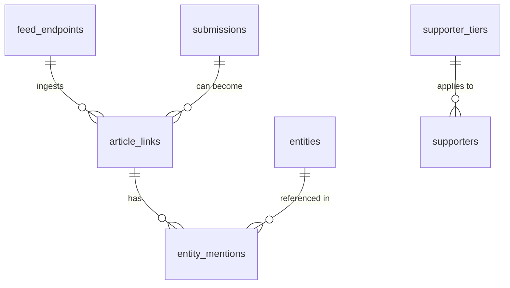

# Database Schema Architecture

## Feed Permanence Doctrine

> [!IMPORTANT]
> **FEED PERMANENCE DOCTRINE**
> Under no circumstances shall database migrations, scripts, or operational procedures delete, drop, truncate, or degrade the records in `feed_endpoints`. 
> 
> Defunct feeds with connection errors (e.g. HTTP 404, 500, or domain expiration) must be preserved for historical reference and validation audits. They are deactivated by setting `is_active = FALSE` and storing their final `http_status` or `validation_error`. 
> 
> For recovering archival pathways without losing the original endpoint URL, the `wayback_url` field is populated to fall back to the Internet Archive's Wayback Machine.

## Core Schema Diagrams



## Tables Reference

### `feed_endpoints`
- `id` (SERIAL PRIMARY KEY)
- `url` (TEXT UNIQUE NOT NULL)
- `title` (TEXT)
- `is_active` (BOOLEAN DEFAULT TRUE)
- `http_status` (INT)
- `last_checked_at` (TIMESTAMPTZ)
- `validation_error` (TEXT)
- `wayback_url` (TEXT)

### `article_links`
- `id` (UUID PRIMARY KEY)
- `feed_endpoint_id` (INT REFERENCES feed_endpoints)
- `title` (TEXT NOT NULL)
- `canonical_url` (TEXT NOT NULL)
- `content_snippet` (TEXT)
- `published_at` (TIMESTAMPTZ)
- `relevance_score` (FLOAT)
- `relevance_version` (INT)
- `relevance_checked_at` (TIMESTAMPTZ)
- `dq_score` (FLOAT)
- `dq_missing_fields` (TEXT[])
- `dq_checked_at` (TIMESTAMPTZ)
- `og_image_url` (TEXT)
- `og_image_scraped_at` (TIMESTAMPTZ)

### `entities`
- `id` (SERIAL PRIMARY KEY)
- `canonical_name` (TEXT UNIQUE NOT NULL)
- `aliases` (TEXT[])
- `entity_type` (TEXT NOT NULL)
- `slug` (TEXT UNIQUE NOT NULL)
- `dominant_color` (TEXT)
- `meta` (JSONB)

### `entity_mentions`
- `id` (SERIAL PRIMARY KEY)
- `article_link_id` (UUID REFERENCES article_links ON DELETE CASCADE)
- `entity_id` (INT REFERENCES entities ON DELETE CASCADE)
- `confidence_score` (FLOAT)
- `extracted_at` (TIMESTAMPTZ DEFAULT NOW())

### `supporter_tiers`
- `id` (SERIAL PRIMARY KEY)
- `name` (TEXT UNIQUE NOT NULL)
- `display_name` (TEXT NOT NULL)
- `price_usd` (FLOAT)
- `billing_type` (TEXT DEFAULT 'one_time')
- `is_active` (BOOLEAN DEFAULT TRUE)
- `features` (JSONB DEFAULT '[]')

### `supporters`
- `id` (SERIAL PRIMARY KEY)
- `email` (TEXT NOT NULL)
- `display_name` (TEXT)
- `social_handle` (TEXT)
- `social_platform` (TEXT)
- `is_anonymous` (BOOLEAN DEFAULT FALSE)
- `tier_id` (INT REFERENCES supporter_tiers)
- `stripe_customer_id` (TEXT)
- `stripe_payment_id` (TEXT)
- `is_active` (BOOLEAN DEFAULT TRUE)
- `physical_gift_sent` (BOOLEAN DEFAULT FALSE)
- `physical_gift_address` (JSONB)
- `joined_at` (TIMESTAMPTZ DEFAULT NOW())
- `notes` (TEXT)

### `submissions`
- `id` (SERIAL PRIMARY KEY)
- `submission_type` (TEXT NOT NULL)
- `entity_name_or_url` (TEXT)
- `description` (TEXT)
- `contact_email` (TEXT)
- `suggested_tags` (TEXT[])
- `status` (TEXT DEFAULT 'pending')
- `reviewer_notes` (TEXT)
- `created_at` (TIMESTAMPTZ DEFAULT NOW())
- `reviewed_at` (TIMESTAMPTZ)
```
