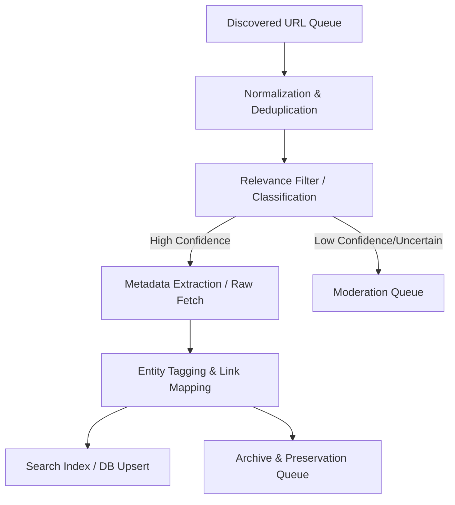

# Crawler & Storage Architecture

This document defines the architecture, data pipeline, storage layout, and orchestration strategies for the Sailing Almanac's crawler and ingestion fleet.

---

## 🏛️ Ingestion Pipeline Architecture

To prevent building a monolithic engine, crawling and ingestion are decoupled into isolated services communicating via message queues. The primary system relies on a **state-driven link lifecycle**.



### 1. The Discovered URL Queue
* **Role**: The entry point for any new URL found in feeds, Inoreader webhooks, polled inbox emails, or manual submissions.
* **Storage**: Redis list (`queue:discovered_urls`) or a lightweight Postgres jobs table (`ingestion_jobs`).
* **Contract**: Minimally requires `{ url, source_feed_id, discovery_timestamp, priority, language }`.

### 2. Normalization & Deduplication
* **Normalization Rules**:
  * Strip standard tracking queries (`utm_*`, `ref`, `fbclid`, etc.).
  * Resolve protocol redirects (`http` to `https`).
  * Force canonical formatting (e.g. trailing slashes, consistent subdomains).
* **Deduplication Check**:
  * Generate a SHA-256 fingerprint of the normalized URL.
  * Query Postgres `article_links` table for existing fingerprints. If it exists, append the discovery signal to the existing link's evidence log rather than creating a new record.

### 3. Relevance & Classification
* A lightweight filter determines if the link concerns sailing, racing, yachting, windsurfing, or kiteboarding.
* **Filtering Stack**:
  * Domain/URL pattern check (instant match/reject based on rule lists).
  * Page title/description regex scanning.
  * *Negative classification*: Matches cruise-vacation, shipping freight, or military cargo patterns for immediate rejection.

### 4. Raw Fetch & Extraction
* Fetches the page content with a randomized User-Agent matching standard crawler practices.
* Respects `robots.txt` and domain rate-limiting.
* Extracts core Metadata: Author, Title, Pub Date, Lead Image, and Clean Body Text.

### 5. Entity Tagging & Relationship Mapping
* Runs Named Entity Recognition (NER) and custom keyword extraction rules to link the article to Almanac nodes (e.g. `One-Design J/70 Class`, `Key West Regatta`, `Alan Woodyard`).

---

## ⏱️ Scheduling & Multilingual Queue Weights

The crawlers search across 50 languages (defined in the language metadata) with weighted resource allocation to prevent VPS overload:

### Queue Concurrency Tiers
1. **`queue:crawl:high` (English - `en`)**: Heavily weighted. 5 concurrent workers. Real-time/hourly polling.
2. **`queue:crawl:medium` (German - `de`, Italian - `it`, French - `fr`)**: Strongly weighted. 2 concurrent workers. Six-hour polling.
3. **`queue:crawl:low` (Remaining 46 Languages)**: Slower pace. 1 concurrent worker executing sequentially. Daily/weekly sweeps.

### Time-Order Strategy
* **live ingestion (Jan 1, 2025 - Present)**: Always runs at high priority on the active queue.
* **historical backfill (Pre-2025)**: Low-priority tasks scheduled dynamically. Runs when the active queue is empty.

---

## 💾 Backblaze B2 Storage Architecture

We store raw and processed snapshot assets in a Backblaze B2 bucket (S3-compatible API). 

### Bucket Organization
```text
[bucket-name]/
  ├── raw-html/
  │     └── [language-code]/      # e.g., en, de, fr, it
  │           └── [year]/[month]/[sha256-fingerprint].html
  ├── clean-markdown/
  │     └── [language-code]/
  │           └── [year]/[month]/[sha256-fingerprint].md
  ├── media/
  │     └── [year]/[month]/[sha256-fingerprint].[ext]
  └── db-backups/
        └── [year]/[month]/[day]-backup.sql.gz
```

### Content Ingestion & Formatting (Readability-to-Markdown)
To protect our system from link rot and maintain clean indices:
1. **Fetch**: The crawler stores the **raw HTML payload** in B2 (`raw-html/`).
2. **Readability Extract**: We parse the raw HTML using **Mozilla Readability (`@mozilla/readability`)** in Node.js to strip navbars, sidebars, tracking scripts, and advertisements.
3. **Markdown Conversion**: The clean HTML output from Readability is converted into clean **Markdown** using **Turndown (`turndown`)**.
4. **Save**: The Markdown document is saved to B2 (`clean-markdown/`). This serves as the text source for indexing and semantic tag matching.

---

## 🌐 External Archival (Internet Archive Integration)

To ensure global resilience of source links, every approved article triggers an automatic snapshot request to the Internet Archive (Wayback Machine).

* **Trigger Timing**: Asynchronous job executed post-ingestion by `almanac-worker-archive`.
* **API Target**: POST request to `https://web.archive.org/save/[url]`
* **Authentication**: Utilizing API Key headers if necessary to bypass basic IP rate limiting.
* **Status Tracking**: The local database logs the resulting Wayback snapshot URL in the `archive_status` column.

---

## 🚨 Observability & Error Handling

### Retry Policy
* **Transient Errors (503, Timeout, Network Failure)**: Exponential backoff (retry after 2m, 10m, 30m, 2h). Maximum of 4 retries before marking the job as `failed_retry`.
* **Fatal Errors (404, 403, Domain Expired)**: Do not retry. Immediately flag URL as `dead_link` and log the HTTP status.

### Observability Metrics
* **Queue Latency**: Time between discovery and final search indexing.
* **Crawl Success Rate**: Percentage of successful 200 HTTP responses.
* **Suppression Volume**: Ratio of suppressed links to total ingested links.
