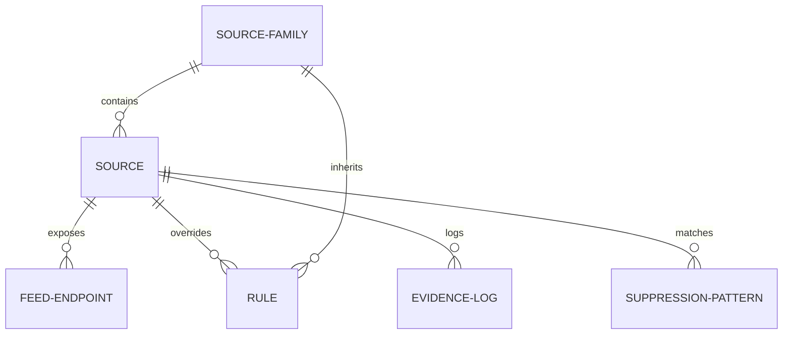

# Source Taxonomy & Rule-Precedence Model

This document outlines the hierarchical taxonomy, data models, and rule-inheritance mechanics of the Sailing Almanac's source intelligence engine.

---

## 📂 Object Models

The database models for sources and policies are defined below:



### 1. `source_family`
Categorizes sources into broad architectural buckets to simplify policy application.
* **Fields**:
  * `id` (UUID, Primary Key)
  * `name` (e.g. `sailing_media`, `yacht_clubs`, `builders`)
  * `display_name` (e.g. "Sailing Media Outlets")
  * `default_crawl_policy_id` (ForeignKey)
  * `base_relevance_weight` (Float, `0.0` to `1.0`)

### 2. `source`
A specific domain or organization providing content.
* **Fields**:
  * `id` (UUID)
  * `source_family_id` (ForeignKey to `source_family`)
  * `domain` (String, unique - e.g. `sailingworld.com`)
  * `name` (String, e.g. "Sailing World")
  * `relevance_score` (Float, custom override)
  * `manual_priority_boost` (Integer, `-100` to `100`)
  * `manual_suppression_flag` (Boolean, default `false`)
  * `crawl_frequency_tier` (Enum: `realtime`, `daily`, `weekly`, `monthly`)
  * `archive_priority` (Enum: `high`, `normal`, `low`, `none`)

### 3. `feed_endpoint`
A specific RSS, Atom, or Webhook feed associated with a source.
* **Fields**:
  * `id` (UUID)
  * `source_id` (ForeignKey to `source`)
  * `url` (String, e.g. `https://www.sailingworld.com/feed/`)
  * `format` (Enum: `rss`, `atom`, `json_feed`, `webhook`)
  * `last_polled_at` (Timestamp)
  * `is_active` (Boolean, default `true`)

### 4. `rule` & `suppression_pattern`
Used to filter out irrelevant content at ingestion.
* **Fields (`suppression_pattern`)**:
  * `id` (UUID)
  * `target_type` (Enum: `global`, `source_family`, `source`)
  * `target_id` (UUID, nullable)
  * `pattern_type` (Enum: `url_regex`, `title_regex`, `body_regex`)
  * `pattern` (String, regex expression)
  * `action` (Enum: `suppress`, `flag_for_review`, `lower_relevance`)

---

## ⛓️ Rule-Precedence Stack

When a new URL is discovered, rules are evaluated from top to bottom. The first matching rule terminates evaluation:

```text
┌──────────────────────────────────────────────────────────┐
│ 1. Hard Global Exclusions                                │
│    - Global domain blacklists (e.g., travel/cruises)     │
│    - Global negative keywords (e.g., "cruise line")      │
├──────────────────────────────────────────────────────────┤
│ 2. Source-Level Overrides                                │
│    - Custom crawler rules for specific domain            │
│    - Manual suppression flag on specific source          │
├──────────────────────────────────────────────────────────┤
│ 3. Source-Family Defaults                                │
│    - Fallback settings for the source's class            │
├──────────────────────────────────────────────────────────┤
│ 4. Feed/Item-Level Temporary Signals                     │
│    - Webhook payload scores or Inoreader temporary flags │
└──────────────────────────────────────────────────────────┘
```

---

## ⛵ Initial Taxonomy Classification

### 1. Sailing Media (Family)
* **Relevance Weight**: `0.9`
* **Default Ingest Policy**: Auto-approve with high trust.
* **Examples**:
  * `Sailing World` (`sailingworld.com`)
  * `Scuttlebutt Sailing News` (`sailingscuttlebutt.com`)
  * `Sail World` (`sail-world.com`)

### 2. Class Associations (Family)
* **Relevance Weight**: `1.0`
* **Default Ingest Policy**: Parse for One-Design tags.
* **Examples**:
  * `International J/70 Class` (`j70ica.org`)
  * `Laser/ILCA Class` (`ilca.sailing.org`)

### 3. Yacht Clubs & Governing Bodies (Family)
* **Relevance Weight**: `0.85`
* **Default Ingest Policy**: High trust, parse for regatta results and locations.
* **Examples**:
  * `Southern Yacht Club` (`southernyachtclub.org`)
  * `US Sailing` (`ussailing.org`)
  * `Gulf Yachting Association` (`gya.org`)

### 4. Builders & Manufacturers (Family)
* **Relevance Weight**: `0.75`
* **Default Ingest Policy**: Map onto Make/Model nodes.
* **Examples**:
  * `J/Boats` (`jboats.com`)
  * `Beneteau` (`beneteau.com`)

### 5. Exclusion Targets (Family)
* **Relevance Weight**: `0.0` (Immediate rejection)
* **Examples of sources that must be filtered out**:
  * `Carnival Cruise Line` (`carnival.com`)
  * `Royal Caribbean` (`royalcaribbean.com`)
  * `MarineTraffic Cargo` (Freight/commercial vessels)
